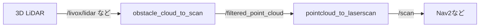

# obstacle_cloud_to_scan
3D LiDARの点群から**障害物のみ**を抽出し、2D `LaserScan` 生成に適した`PointCloud2`を出力するROS 2パッケージです。  
`pointcloud_to_laserscan`と組み合わせて `/scan` を生成できます。


## 概要
`obstacle_cloud_to_scan` は、入力点群をロボット座標系へTF変換・ダウンサンプリング・ロボット車体除去・地面除去（PMFまたは法線ベース）し、**障害物点のみ**の`PointCloud2`を出力します。  
従来の2D LiDARだけでは拾いにくい「机の脚」「パイロン」などの細い障害物も検出しつつ、**登坂可能な傾斜**や**小段差**は障害物として出力しないノードです。



## 特徴
- 3D→2D用の前処理（Voxel + 自己車体除去 + Ground除去）
- 地面除去は以下のアルゴリズムを選択できます
  - **PMF**（台車や低い机を見逃さず障害物検知します）
  - **法線ベース**（台車や低い机を地面と見てしまうことがあるが、高速に処理できます）
- 障害物のみの点群をそのまま `pointcloud_to_laserscan` に接続


## 動作環境
- ROS 2（`humble`,`jazzy`で動作確認）

## インストール

このリポジトリをROS2ワークスペースにクローンし、依存パッケージをインストールしてからビルドします:

```sh
# リポジトリをクローン
cd ~/ros2_ws/src
git clone https://github.com/AbudoriLab-TC2024/obstacle_cloud_to_scan.git

# 依存パッケージをインストール
sudo apt-get update
sudo apt-get install \
  libpcl-dev \
  ros-$ROS_DISTRO-pcl-ros \
  ros-$ROS_DISTRO-pointcloud-to-laserscan \
  ros-$ROS_DISTRO-tf2-ros \
  ros-$ROS_DISTRO-tf2-eigen \
  ros-$ROS_DISTRO-tf2-sensor-msgs

# ビルド
cd ~/ros2_ws
colcon build --packages-select obstacle_cloud_to_scan
```

## 使用方法

① 障害物点群出力のみ（出力:`/filtered_point_cloud`）
```sh
ros2 launch obstacle_cloud_to_scan obstacle_cloud_to_scan.launch.py
```

② `/scan` まで生成（`pointcloud_to_laserscan`併用）
```sh
ros2 launch obstacle_cloud_to_scan filter_obstacle_cloud.launch.py
```

## パラメータ

obstacle_cloud_to_scan ノードのパラメータ

| パラメータ名          | 型        | 説明                                               | デフォルト値    |
|----------------------|-----------|----------------------------------------------------|-----------------|
| `target_frame`      | `string`  | 入力点群をこのフレームへTF変換してから処理 | `base_link`   |
| `input_topic`        | `string`  | 入力の`PointCloud2`トピック名                        | `/livox/lidar`  |
| `output_topic`       | `string`  | 出力の`PointCloud2`トピック名   | `/cloud_in`     |
| `voxel_leaf_size`    | `double`  | ダウンサンプリングのボクセルサイズ。大きくすると高速になるが精度が落ちる。　| `0.05`          |
| `robot_box_size`     | `array`   | ロボット周囲のバウンディングボックスのサイズ（[x, y, z]）、ロボット自身が点群に映り込むときはこのボックスを調整してください。 | `[0.9, 0.8, 1.0]` |
| `robot_box_position` | `array`   | `robot_box_size`の原点（[x, y, z]）          | `[0.0, 0.0, 0.0]` |
| `ground_remove_algorithm`  | `string`    | 地面除去アルゴリズム`NORMAL`,`PMC`のいずれか。誤った値の場合は`NORMAL`が自動選択されます | `NORMAL`         |
| `normal_max_slope_angle`    | `double`  | 法線ベース方式時の最大登坂角[deg]（これ以上の傾きは障害物とみなす）                      | `25.0`          |
| `pmf_max_window_size`| `int`    | PMF窓サイズ上限                      | `33`         |
| `pmf_slope`| `double`    | PMFスロープ                  | `1.0`         |
| `pmf_initial_distance`| `double`    | PMF初期距離[m]                      | `0.15`         |
| `pmf_max_distance`| `double`    | PMF最大距離[m]                      | `3.0`         |
| `pmf_cell_size`| `double`    | PMFセルサイズ[m]                      | `0.5`         |

障害物のみを残す、地面除去アルゴリズムは選択ができます。パラメータの`ground_remove_algorithm`で指定してください。
- 法線[NORMAL]: 法線を見て水平な物体を取り除きます。地面と同時に小さな平らな物体が障害物として残らないことがありますが高速です。
- PMF[PMF]: モルフォロジー処理で地面のみを除去します。室内などモノが多い環境だと速度が低下しますが正確に地面のみを除去します。


pointcloud_to_laserscan ノードのパラメータ

| パラメータ名         | 型        | 説明                                               | デフォルト値  |
|---------------------|-----------|----------------------------------------------------|---------------|
| `target_frame`      | `string`  | LaserScanデータのフレーム名                        | `base_link`   |
| `transform_tolerance` | `double` | トランスフォームの許容時間（秒）                    | `0.01`        |
| `min_height`        | `double`  | フィルタリングするPointCloudの最小高さ（メートル）    | `-1.0`        |
| `max_height`        | `double`  | フィルタリングするPointCloudの最大高さ（メートル）    | `2.0`         |
| `angle_min`         | `double`  | スキャンの開始角度（ラジアン）                       | `-1.5708`     |
| `angle_max`         | `double`  | スキャンの終了角度（ラジアン）                       | `1.5708`      |
| `angle_increment`   | `double`  | スキャンの角度増分（ラジアン）                       | `0.0174`      |
| `scan_time`         | `double`  | スキャンの時間（秒）                                 | `0.1`         |
| `range_min`         | `double`  | レンジの最小値（メートル）                            | `0.1`         |
| `range_max`         | `double`  | レンジの最大値（メートル）                            | `40.0`        |
| `use_inf`           | `bool`    | 無限大を使用して無効なデータポイントを表現するかどうか  | `True`        |
| `inf_epsilon`       | `double`  | 無限大の補正値                                       | `1.0`         |


## トピック

- **入力**: `/point_cloud_in` (`sensor_msgs/PointCloud2`) - 3D LiDARから点群データを受け取ります。
- **出力**:
  - `/filtered_point_cloud` (`sensor_msgs/PointCloud2`) - 障害物のみを含むフィルタリング後の点群データをパブリッシュします。
  - `/scan` (`sensor_msgs/LaserScan`) - フィルタリングされた点群から生成された2D LaserScanメッセージをパブリッシュします。

## ライセンス
このプログラムはApatch2.0のもと公開されています。詳細は`LICENSE`を参照してください。
