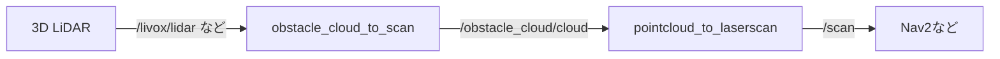

# obstacle_cloud_to_scan
3D LiDARの点群から**障害物のみ**を抽出し、2D `LaserScan` 生成に適した`PointCloud2`を出力するROS 2パッケージです。  
`pointcloud_to_laserscan`と組み合わせて `/scan` を生成できます。


## 概要
`obstacle_cloud_to_scan` は、入力点群をロボット座標系へTF変換・ダウンサンプリング・ロボット車体除去・地面除去（PMFまたは法線ベース）し、**障害物点のみ**の`PointCloud2`を出力します。  
従来の2D LiDARだけでは拾いにくい「机の脚」「パイロン」などの細い障害物も検出しつつ、**登坂可能な傾斜**や**小段差**は障害物として出力しないノードです。

オプションの穴検知機能を有効にすると、ロボットが落下する危険のある階段や窪地を「穴」として検出し、別の点群トピックとして出力します。これはナビゲーションの落下防止機能として活用できます。



## 特徴
- 3D→2D用の前処理（Voxel + 自己車体除去 + Ground除去）
- 地面除去は以下のアルゴリズムを選択できます
  - **法線ベース**（台車や低い机を地面と見てしまうことがあるが、高速に処理できます）
  - **Progressive Morphological Filter(PMF)**（台車や低い机を見逃さず障害物検知します）
- 障害物のみの点群をそのまま `pointcloud_to_laserscan` に接続
- **穴・段差検知機能**（オプション）
  - 地面より低い点群から求めた光線と地面平面の交点計算による穴検知
  - 階段落下防止やくぼみ回避に利用可能


## 動作環境
- ROS 2（`humble`,`jazzy`で動作確認）

## インストール

このリポジトリをROS2ワークスペースにクローンし、依存パッケージをインストールしてからビルドします:

```sh
# リポジトリをクローン
cd ~/ros2_ws/src
git clone https://github.com/AbudoriLab-TC2024/obstacle_cloud_to_scan.git

# 依存パッケージをインストール
sudo apt update
sudo apt install \
  libpcl-dev \
  ros-$ROS_DISTRO-pcl-ros \
  ros-$ROS_DISTRO-pointcloud-to-laserscan \
  ros-$ROS_DISTRO-tf2-ros \
  ros-$ROS_DISTRO-tf2-eigen \
  ros-$ROS_DISTRO-tf2-sensor-msgs

# ビルド
cd ~/ros2_ws
colcon build --packages-select obstacle_cloud_to_scan
```

## 使用方法

① `/scan` まで生成（`pointcloud_to_laserscan`併用）
```sh
ros2 launch obstacle_cloud_to_scan obstacle_cloud_to_scan.launch.py
```


② 障害物点群出力のみ（出力:`/obstacle_cloud/cloud`）
```sh
ros2 launch obstacle_cloud_to_scan filter_obstacle_cloud.launch.py
```

## トピック

- **入力**: `/point_cloud_in` (`sensor_msgs/PointCloud2`) - 3D LiDARから点群データを受け取ります。
- **出力**:
  - `/obstacle_cloud/cloud` (`sensor_msgs/PointCloud2`) - 障害物のみを含むフィルタリング後の点群データをパブリッシュします。
  - `/hole_cloud/cloud` (`sensor_msgs/PointCloud2`) - 穴検知機能有効時に、検知された穴の位置をパブリッシュします。


## パラメータ

`obstacle_cloud_to_scan`ノードのパラメータ

| パラメータ名          | 型        | 説明                                               | デフォルト値    |
|----------------------|-----------|----------------------------------------------------|-----------------|
| `target_frame`      | `string`  | 入力点群をこのフレームへTF変換してから処理 | `base_link`   |
| `lidar_frame`| `string`    | LiDARセンサのフレーム名                      | `livox_frame`         |
| `input_topic`        | `string`  | 入力の`PointCloud2`トピック名                        | `/livox/lidar`  |
| `output_topic`       | `string`  | 出力の`PointCloud2`トピック名   | `/obstacle_cloud/cloud`     |
| `hole_output_topic`| `string`    | 穴点群の出力トピック名                      | `/hole_cloud/cloud`         |
| `voxel_leaf_size`    | `double`  | ダウンサンプリングのボクセルサイズ。大きくすると高速になるが精度が落ちる。　| `0.1`          |
| `robot_box_size`     | `array`   | ロボット周囲のバウンディングボックスのサイズ（[x, y, z]）、ロボット自身が点群に映り込むときはこのボックスを調整してください。 | `[0.9, 0.8, 1.0]` |
| `robot_box_position` | `array`   | `robot_box_size`の原点（[x, y, z]）          | `[0.0, 0.0, 0.0]` |
| `ground_remove_algorithm`  | `string`    | 地面除去アルゴリズム`NORMAL`,`PMF`のいずれか。誤った値の場合は`NORMAL`が自動選択されます | `NORMAL`         |
| `normal_max_slope_angle`    | `double`  | [NORMAL] 法線ベース方式時の最大登坂角[deg]（これ以上の傾きは障害物とみなす）                      | `25.0`          |
| `normal_radius`    | `double`  | [NORMAL] 法線計算時に用いる近傍の点の最大距離[m]。これより遠い点同士は法線計算時に考慮しない。                | `0.6`          |
| `pmf_max_window_size`| `int`    | [PMF] モルフォロジー演算の最大ウィンドウサイズ| `33`         |
| `pmf_slope`| `double`    | [PMF] 地面とみなす最大傾斜| `1.0`         |
| `pmf_initial_distance`| `double`    | [PMF] 地面とみなす初期の高さしきい値[m]                      | `0.15`         |
| `pmf_max_distance`| `double`    | [PMF] 地面とみなす最大高さしきい値[m]                      | `3.0`         |
| `pmf_cell_size`| `double`    | [PMF] 点群を分割するセルのサイズ[m]                      | `0.5`         |
| `hole_detection_enabled`| `bool`    | 穴検知機能の有効/無効                      | `false`         |
| `hole_detection_algorithm`| `string`    | [穴検知] アルゴリズムの選択（`BASIC`, `GRID`）**GRID未実装**                    | `BASIC`         |
| `hole_detection_range_x`| `double`    | [穴検知] ロボット前方への検知範囲[m]（前方への検知距離）                      | `3.0`         |
| `hole_detection_range_y`| `double`    | [穴検知] ロボット左右方向の検知範囲[m]（左右への検知幅）                     | `5.0`         |
| `hole_detection_max_height`| `double`    | [穴検知] 検知対象の点群の最大高さ[m]                      | `0.3`         |
| `hole_ground_tolerance`| `double`    | [穴検知] 地面点群の高さ方向のゆらぎの許容誤差[m]                     | `0.05`         |

### 障害物検知のアルゴリズム選択
障害物のみを残す、地面除去アルゴリズムは選択ができます。パラメータの`ground_remove_algorithm`で指定してください。
- 法線[NORMAL]: 法線を見て水平な物体を取り除きます。地面と同時に小さな平らな物体が障害物として残らないことがありますが高速です。
- PMF[PMF]: モルフォロジー処理で地面のみを除去します。室内などモノが多い環境だと速度が低下しますが正確に地面のみを除去します。

### 穴検知機能
`hole_detection_enabled`を`true`にすると穴検知機能が有効になります。この機能は以下の仕組みで動作します：

- **検知原理**: 地面より低い点群の光線と地面平面の交点を計算します。交点が求められれば、本来地面があるべき場所に点群がない、つまり穴であると判定します。
- **検知範囲**: ロボット前方`hole_detection_range_x`m × 左右`hole_detection_range_y`m
- **高さ制限**: 地面から高さ`hole_detection_max_height`m以下の点群のみを対象
- **判定閾値**: `hole_ground_tolerance`以上の深さを穴として判定
- **出力**: 穴の位置（地面交点）を`hole_output_topic`にパブリッシュ


`pointcloud_to_laserscan`ノードのパラメータ

| パラメータ名         | 型        | 説明                                               | デフォルト値  |
|---------------------|-----------|----------------------------------------------------|---------------|
| `target_frame`      | `string`  | LaserScanデータのフレーム名                        | `base_link`   |
| `transform_tolerance` | `double` | トランスフォームの許容時間（秒）                    | `0.01`        |
| `min_height`        | `double`  | フィルタリングするPointCloudの最小高さ（メートル）    | `-1.0`        |
| `max_height`        | `double`  | フィルタリングするPointCloudの最大高さ（メートル）    | `2.0`         |
| `angle_min`         | `double`  | スキャンの開始角度（ラジアン）                       | `-1.5708`     |
| `angle_max`         | `double`  | スキャンの終了角度（ラジアン）                       | `1.5708`      |
| `angle_increment`   | `double`  | スキャンの角度増分（ラジアン）                       | `0.0174`      |
| `scan_time`         | `double`  | スキャンの時間（秒）                                 | `0.1`         |
| `range_min`         | `double`  | レンジの最小値（メートル）                            | `0.1`         |
| `range_max`         | `double`  | レンジの最大値（メートル）                            | `40.0`        |
| `use_inf`           | `bool`    | 無限大を使用して無効なデータポイントを表現するかどうか  | `True`        |
| `inf_epsilon`       | `double`  | 無限大の補正値                                       | `1.0`         |

## トラブルシュート
PointCloudやLaserScanがRviz2で表示されない場合

本パッケージおよび LiDAR 系ノードは **SensorDataQoS（= Best Effort / Volatile）** を前提としています。
RViz2 の表示はデフォルトで Reliable の場合があるため、表示が出ないときは以下を確認してください。

- RViz2 の `LaserScan`（または `PointCloud2`）ディスプレイで **Reliability を Best Effort** に変更
- QoS の整合性チェック
```bash
  ros2 topic info /cloud_in --verbose
  ros2 topic info /scan --verbose
```

## ライセンス
このプログラムはApatch2.0のもと公開されています。詳細は`LICENSE`を参照してください。
